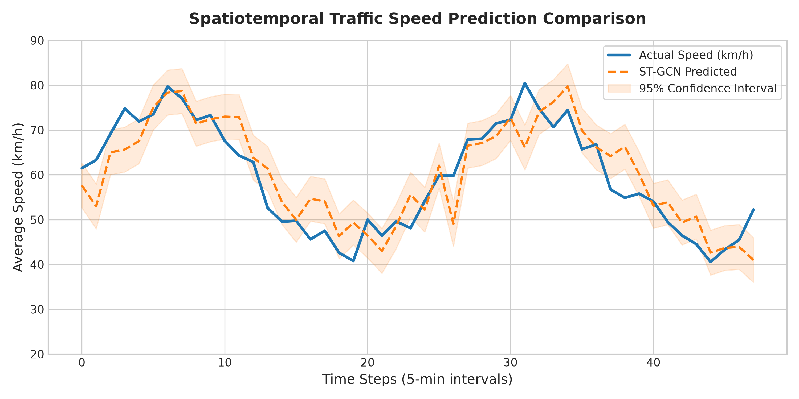
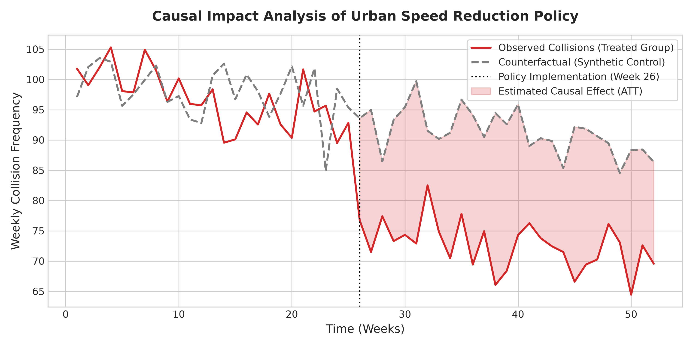
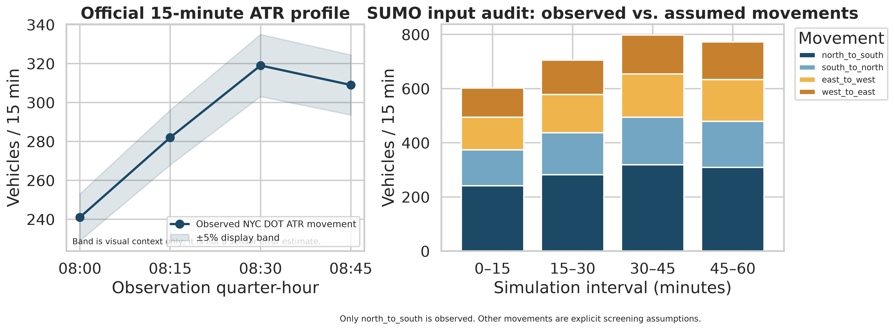
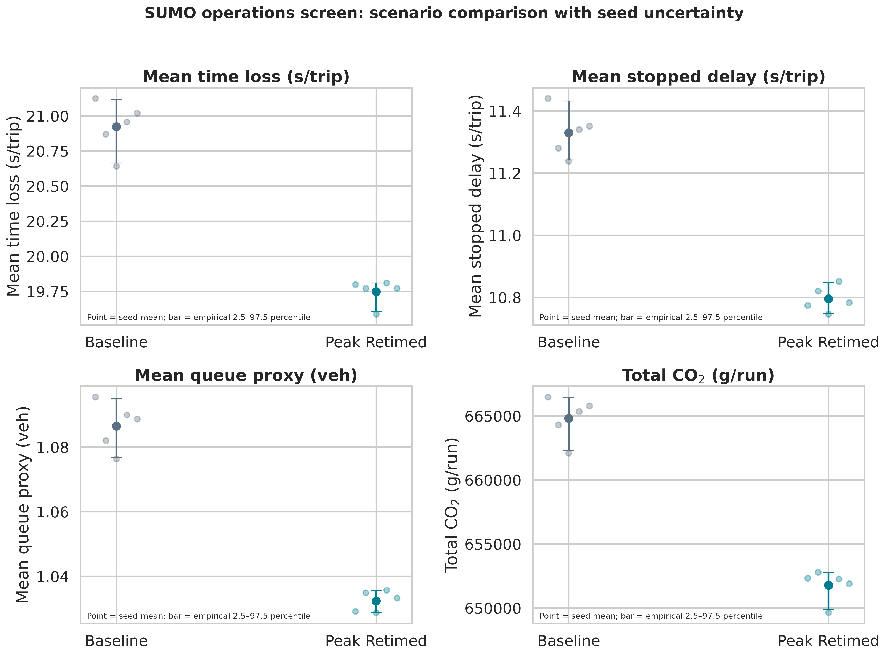

# Urban Transportation Intelligence Portfolio

[](https://www.python.org/) [](https://sumo.dlr.de/) [](https://opensource.org/licenses/MIT)

> **Focus:** Intelligent Transportation Systems (ITS), travel-demand planning, GIS accessibility and equity, traffic-safety statistics, and traffic operations simulation.
>
> **Portfolio standard:** Open/public data, explicit provenance, reproducible code, uncertainty reporting, and a clear boundary between observed evidence and scenario assumptions.

## 1. Executive summary

This repository is a **PhD-level transportation engineering analytics portfolio** for the analytical questions faced by public agencies, DOTs, MPOs, and mobility teams. It demonstrates a full workflow from public-data acquisition and quality control to spatial, statistical, and simulation modeling, uncertainty-aware evaluation, technical visualization, and responsible interpretation.

The four complementary modules demonstrate advanced methods alongside the governance discipline required for reviewable public-sector analytics. Forecasting evaluates predictive performance; causal analysis states an identification strategy; crash statistics report associations with uncertainty; planning scenarios are sensitivity tests; and SUMO produces conditional simulation comparisons rather than claims about field benefits.

| Module | Public-data foundation | Principal methods | Decision-facing outputs |
| --- | --- | --- | --- |
| [`src/`](src/) | Transportation system and mobility data workflows | Spatiotemporal graph concepts, LightGBM, spatial lags, Difference-in-Differences | Traffic forecasts, causal-design utilities, and visual diagnostics |
| [`travel_demand_gis/`](travel_demand_gis/) | Census ACS, TIGER/Line geometry, and LEHD LODES [3] | Trip-end development, doubly constrained gravity model, Furness/IPF, accessibility and equity metrics | GeoPackage, CSV/JSON exports, calibration table, and scenario maps |
| [`crash_statistics/`](crash_statistics/) | City of Chicago crash records [4] | Logistic inference, adjusted odds ratios, bootstrap/Wilson intervals, calibration and discrimination checks | Inference tables, confidence intervals, run manifest, and five figures |
| [`sumo_public_ops/`](sumo_public_ops/) | NYC DOT Automated Traffic Volume Counts [2] and Eclipse SUMO [5] | Count QA, demand ledger, `netconvert`, signal scenarios, multi-seed simulation, paired KPI deltas | Input audit, KPI scorecard, queue/emissions outputs, and manifest |

## 2. Featured analytical modules

### 2.1. Spatiotemporal ITS forecasting and causal safety design

The foundational [`src/`](src/) module demonstrates spatial preprocessing, spatial-lag gradient boosting, an ST-GCN architecture, and visual diagnostics for short-horizon traffic-state prediction. Its causal-inference utilities frame policy evaluation as a Difference-in-Differences problem rather than treating correlation as impact.



*Figure 1. Example traffic-state forecast visualization with predicted trajectories and uncertainty bounds.*



*Figure 2. Example policy-evaluation visualization. Causal interpretation depends on the documented identification assumptions and diagnostics.*

### 2.2. DOT/MPO travel demand, planning, GIS, and equity

[`travel_demand_gis/`](travel_demand_gis/) is an open-data planning screen for transparent early-stage analysis, not a replacement for an adopted activity-based or four-step regional model. The workflow uses public Census and LODES inputs to create trip ends, balance a gravity OD matrix through Furness/IPF, calibrate a transparent impedance parameter, estimate cumulative and gravity-based opportunity access, export GIS-ready products, and compare a configurable equity screen.

The included generalized-cost change is explicitly labelled a **sensitivity case**, not a project forecast. The module documents how to replace centroid sketch impedances with adopted auto, transit, bicycle, or walk network skims before formal decision use.

### 2.3. Advanced crash statistics and visualization

[`crash_statistics/`](crash_statistics/) turns a public crash-record feed into a reviewable statistical screening workflow. It constructs a crash-level injury outcome, estimates multivariable logistic regression, reports adjusted odds ratios and Wald confidence intervals, quantifies uncertainty through bootstrap and Wilson intervals, and discloses held-out ROC-AUC, average precision, Brier score, and calibration results.

> **Interpretation boundary:** This is an associational analysis of reported crash records. It is not a causal impact evaluation, exposure-adjusted risk model, fault assignment, or automatic project-prioritization rule.

### 2.4. Public-data SUMO operations screening

[`sumo_public_ops/`](sumo_public_ops/) provides a complete, reproducible microsimulation workflow for a public-agency screening question: how do alternative green-time allocations affect modeled delay, queue proxies, trip completion, and emissions under a shared demand and network contract? It retrieves an official 15-minute NYC DOT ATR profile, records source metadata and input QA, builds a representative four-leg SUMO network, and compares baseline and peak-direction retimed programs within a common 70-second cycle.

The committed reference run uses **five matched stochastic seeds**. It aggregates SUMO trip and lane-area-detector output, converts tripinfo emissions from mg to g, and reports paired scenario deltas with empirical 2.5–97.5 percentile intervals. In this **conditional benchmark**, the peak-retimed case has unchanged completed trips and lower modeled mean time loss (5.61%), stopped delay (4.72%), queue proxy (4.98%), and CO₂ (1.96%). These are scenario results, not estimates of benefits for a real field retiming project: representative geometry, unobserved movements, turning paths, and field calibration remain explicit assumptions.



*Figure 3. The input audit separates the observed ATR-based movement from screening assumptions.*



*Figure 4. Seed-level means and empirical uncertainty intervals for the two signal-timing scenarios.*

| SUMO technical-review artifact | Purpose |
| --- | --- |
| [`outputs/run_manifest.json`](sumo_public_ops/outputs/run_manifest.json) | Source query, horizon, seeds, network, demand assumptions, scenario timings, and generated outputs |
| [`outputs/sumo_demand_input_audit.csv`](sumo_public_ops/outputs/sumo_demand_input_audit.csv) | Observed-versus-assumed movement ledger |
| [`outputs/scenario_deltas_vs_baseline.csv`](sumo_public_ops/outputs/scenario_deltas_vs_baseline.csv) | Seed-paired KPI deltas with empirical uncertainty intervals |
| [`docs/research_notes_sumo_public_ops.md`](docs/research_notes_sumo_public_ops.md) | Public-data scope, scenario-design boundary, and visual-QA record |
| [`tests/test_sumo_public_ops.py`](tests/test_sumo_public_ops.py) | Tests for demand labeling, emissions units, and paired comparisons |

## 3. Reproduce the portfolio

```bash
git clone https://github.com/dy-chang/urban-transport-intelligence.git
cd urban-transport-intelligence
python -m venv .venv
source .venv/bin/activate
python -m pip install -r requirements.txt
```

| Module | Command | Prerequisite |
| --- | --- | --- |
| Travel demand / GIS | `PYTHONPATH=. python -m travel_demand_gis.run_screen --state 11 --county 001 --state-abbr dc --acs-year 2023 --lodes-year 2022` | Set `CENSUS_API_KEY` for ACS access. |
| Travel-demand figures | `PYTHONPATH=. python -m travel_demand_gis.visualize` | Run the planning screen first. |
| Crash statistics | `PYTHONPATH=. python -m crash_statistics.run_analysis --limit 120000 --refresh --bootstrap-reps 1000` | A Socrata app token is optional. |
| SUMO operations | `sudo apt-get install -y sumo sumo-tools && PYTHONPATH=. python -m sumo_public_ops.run_sumo --replications 5 --refresh-counts` | Eclipse SUMO and network access to NYC Open Data. |
| SUMO figures | `PYTHONPATH=. python -m sumo_public_ops.visualize` | Run the SUMO workflow first. |
| Module tests | `PYTHONPATH=. pytest -q tests/test_travel_demand_gis.py tests/test_crash_statistics.py tests/test_sumo_public_ops.py` | Install the project dependencies. |

Refreshable raw API caches and voluminous per-run SUMO logs are intentionally excluded where appropriate. Committed manifests, derived tables, figures, and deterministic tests preserve a clear review trail while underlying public inputs remain retrievable.

## 4. Professional skill matrix

| Skill family | Evidence | Public-sector value |
| --- | --- | --- |
| **Transportation data engineering** | Socrata, Census, and LEHD acquisition; schema controls; cache policy; provenance manifests | Repeatable analytics and open-data governance |
| **Machine learning and forecasting** | Spatial preprocessing, graph-learning concepts, gradient boosting, diagnostics | Traffic-management and operational-awareness applications |
| **Causal and statistical inference** | DiD framing, regression inference, odds ratios, bootstrap/Wilson intervals, held-out diagnostics | Credible communication of evidence and uncertainty |
| **Demand, GIS, and equity** | Gravity distribution, IPF, accessibility, FIPS/GEOID-preserving joins, GeoPackage exports | LRTP, corridor, and equity screening |
| **Traffic operations and simulation** | `netconvert`, signal programs, detectors, tripinfo, emissions, multi-seed design | Transparent preliminary operations screening |
| **Scientific communication and software quality** | 300-DPI figures, maps, assumption ledgers, modular code, deterministic tests | Reviewable, maintainable work products |

## 5. Responsible use

Public administrative records can be incomplete or amended and may not match the desired analytical denominator. Travel-demand sketch models require adopted regional inputs and validated skims before project decisions. Crash-record associations need a separate causal identification strategy before they are presented as intervention effects. SUMO screening requires a QA-reviewed network, observed turning movements, vehicle mix, multimodal inputs, independent field calibration, and agency review before it can inform an implemented timing plan.

> **The portfolio demonstrates transparent data contracts, appropriate methods, reproducible execution, uncertainty-aware outputs, and honest decision boundaries.**

## Sources

[1] [Caltrans, *Performance Measurement System (PeMS)*](https://pems.dot.ca.gov/)

[2] [NYC Open Data, *Automated Traffic Volume Counts*](https://data.cityofnewyork.us/Transportation/Automated-Traffic-Volume-Counts/7ym2-wayt)

[3] [U.S. Census Bureau, *American Community Survey*](https://www.census.gov/programs-surveys/acs) and [LEHD Origin-Destination Employment Statistics (LODES)](https://lehd.ces.census.gov/data/)

[4] [City of Chicago Data Portal, *Traffic Crashes – Crashes*](https://data.cityofchicago.org/Transportation/Traffic-Crashes-Crashes/85ca-t3if)

[5] [Eclipse SUMO Documentation](https://sumo.dlr.de/docs/)
