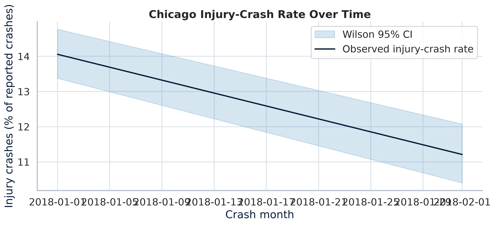
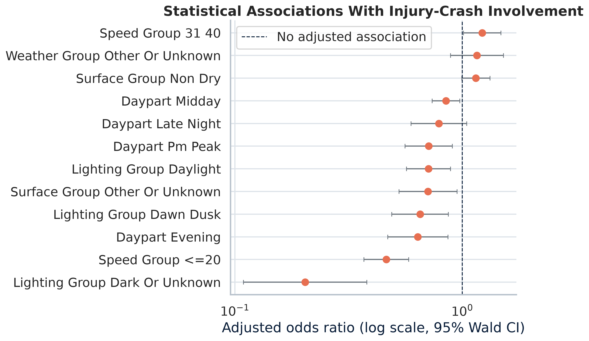
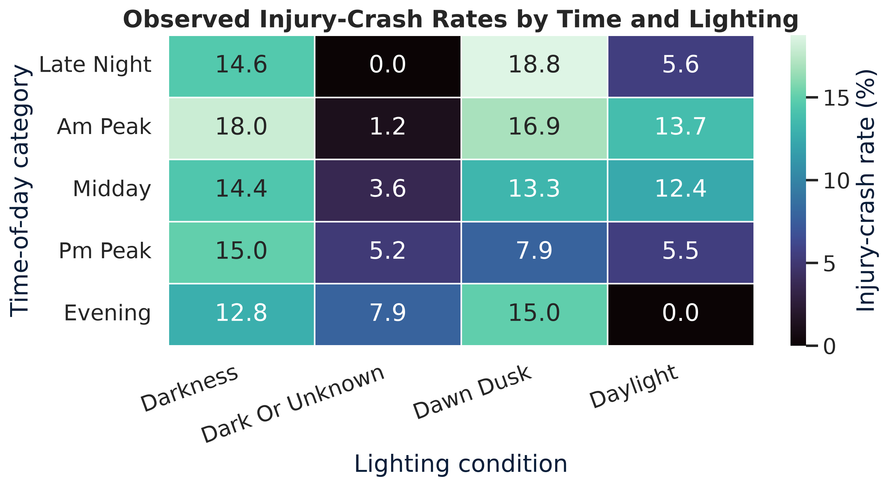
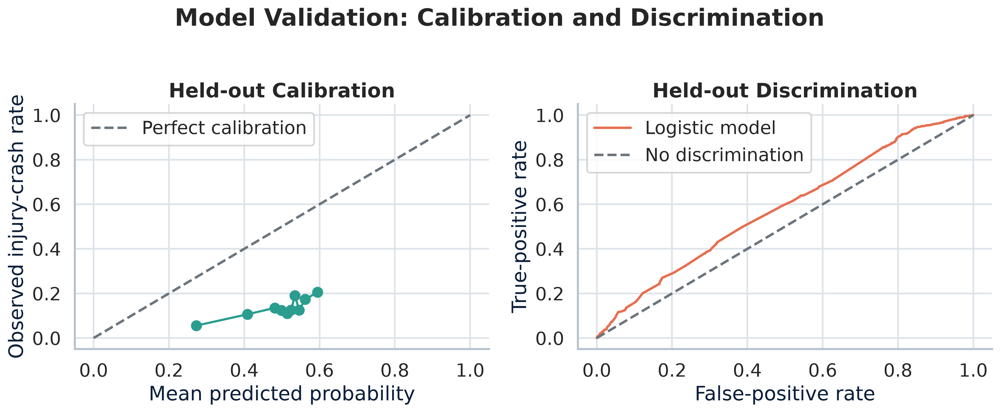
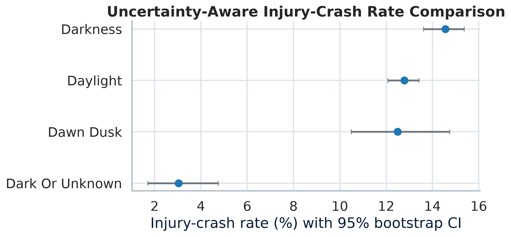

# Uncertainty-Aware Traffic Safety Inference & Visualization

> **Portfolio module for transportation safety analytics, statistical inference, and public-sector communication.**
>
> **Question:** Which crash-context features are statistically associated with a reported injury crash, and how can those associations, uncertainty, and model limitations be communicated responsibly?

This module converts an official public crash-record feed into an **auditable association analysis**. It is intentionally distinct from a predictive black box: the workflow reports confidence intervals, held-out diagnostics, data limitations, and an explicit non-causal interpretation. It demonstrates the kind of evidence discipline that public-sector analytics teams need when using descriptive crash data to guide screening, field review, and communication.

The project uses the City of Chicago’s public **Traffic Crashes – Crashes** dataset. The City describes it as CPD-jurisdiction crash information with citywide coverage from September 2017 onward; records are updated as crash reports are finalized or amended.[1] CDOT publishes annual crash reports, monthly fatal-crash summaries, and geographic safety products, providing a direct planning and safety-analysis context for clear, uncertainty-aware visual communication.[2]

## Analytical Architecture

| Stage | Method | Evidence produced | Decision-use boundary |
|---|---|---|---|
| **Data engineering** | Official Socrata API query, fixed field list, timestamp filter, raw-cache policy, unique crash IDs | Reproducible `run_manifest.json` with source, vintage, row counts, period, and seed | Refreshes public data; does not redistribute raw records. |
| **Outcome construction** | `injury_crash = 1` when crash-level `injuries_total > 0` | Explicit crash-level binary outcome | Does not infer person-level injury risk or severity. |
| **Adjusted association model** | Multivariable logistic regression with categorical weather, lighting, surface, speed, intersection, and daypart terms | Adjusted odds ratios, 95% Wald CIs, p-values | Associations only; no causal identification or exposure adjustment. |
| **Uncertainty quantification** | Stratified non-parametric bootstrap for group injury-crash rates; Wilson intervals for monthly rates | Percentile 95% CIs and binomial 95% CIs | Shows sampling uncertainty, not all measurement or reporting error. |
| **Validation** | Held-out ROC-AUC, average precision, Brier score, reliability curve | Discrimination and calibration diagnostics | A screening model, not a deployment-ready risk engine. |
| **Visual communication** | Forest plot, uncertainty-aware rate chart, risk heatmap, calibration/ROC panel | 300-DPI, report-ready graphics | Supports discussion; does not rank projects or assign fault. |

## Public Data Contract

The crash table contains one record per crash and can be linked to the City’s People and Vehicles tables using `CRASH_RECORD_ID`.[1] This implementation deliberately preserves a **crash-level denominator**. The People table has one record per occupant or other person involved, and may have multiple person records per crash; joining it into the primary model without a different estimand would distort the denominator.[3]

| Data asset | API / source | Use in this module | Key limitation retained in the analysis |
|---|---|---|---|
| Traffic Crashes – Crashes | `85ca-t3if` on Chicago Open Data | Crash context, time, reported injuries, location | Excludes many crashes where CPD was not the responding agency; attributes are officer-reported.[1] |
| Traffic Crashes – People | `u6pd-qa9d` on Chicago Open Data | Documented extension for person-level questions | One-to-many relationship with a crash record; not mixed into crash-level inference.[3] |
| CDOT safety data resources | City traffic-safety portal | Public-sector reporting and communication context | Does not itself provide exposure, intervention assignment, or causal controls.[2] |

## Results Snapshot: Real Public-Data Run

A reproducible **15,000-record official-data extract** was executed for the committed example, with a 75/25 stratified train/test split and 300 bootstrap repetitions. The API’s chronological ordering means the example snapshot covers **2018-01-01 through 2018-02-17**; the script is parameterized for larger or refreshed extracts. The held-out ROC-AUC was **0.581**, average precision **0.168**, and Brier score **0.246**. These values are retained as an honest diagnostic: the selected report fields offer modest screening discrimination and should not be represented as an operational crash-prediction system.

| Figure | What it demonstrates | Interpretation discipline |
|---|---|---|
|  | Monthly crash-level injury rate with Wilson 95% CI | Rates are descriptive and depend on reported crashes, not traffic exposure. |
|  | Adjusted odds ratios on a log scale with 95% Wald CIs | The dashed line is the null association; coefficients are not causal effects. |
|  | Observed rates by daypart and lighting | Small cells and “unknown” categories require contextual review. |
|  | Held-out calibration and ROC diagnostics | Validation is reported beside—not hidden behind—the model. |
|  | Bootstrap 95% CI by lighting group | Group-rate uncertainty is displayed directly. |

## Professional Skillset Demonstrated

| Skill family | Concrete evidence in the codebase | Why it is valuable |
|---|---|---|
| **Statistical inference** | Logistic regression, odds ratios, Wald confidence intervals, hypothesis tests, explicit reference categories | Moves beyond variable-importance charts to interpretable coefficient uncertainty. |
| **Resampling & uncertainty** | Deterministic stratified bootstrap, Wilson score intervals, sampling-denominator reporting | Demonstrates that point estimates alone are insufficient for safety communication. |
| **Predictive validation** | Out-of-sample ROC-AUC, average precision, Brier score, calibration table | Separates in-sample fit from generalization and probability quality. |
| **Data engineering** | Socrata API client, fixed schema, cache controls, provenance manifest, duplicate checks | Makes an open-data analysis reproducible and reviewable. |
| **Transportation safety analytics** | Crash-level outcome discipline, contextual risk segmentation, public-agency data caveats | Keeps scope aligned with real crash-reporting practices. |
| **Scientific visualization** | Log-scale forest plot, uncertainty ribbons, confidence intervals, heatmap, validation panel | Communicates effect size, uncertainty, and limitations in one visual language. |
| **Software quality** | Type annotations, modular functions, deterministic seed, unit tests, non-interactive CLI | Enables peer review and safe extension. |

## Reproduce the Analysis

```bash
# Clone and install
pip install -r requirements.txt

# Optional: supply a Socrata app token for higher request quotas
export CHICAGO_DATA_PORTAL_APP_TOKEN="your_optional_token"

# Execute a refreshed 120,000-record public-data analysis
PYTHONPATH=. python -m crash_statistics.run_analysis \
  --limit 120000 --refresh --bootstrap-reps 1000

# Run the deterministic core tests
PYTHONPATH=. pytest -q tests/test_crash_statistics.py
```

The local raw cache remains in `crash_statistics/data/` and is intentionally excluded from version control. Derived figures and tabular results are committed to `outputs/` for transparent portfolio review. The `run_manifest.json` records the source, actual coverage, row counts, outcome definition, features, metrics, bootstrap design, and interpretation boundary for each run.

## Responsible Interpretation

> **This is an associational screening workflow, not an impact evaluation, counterfactual estimate, fault assignment, or project-prioritization rule.**

The City notes that weather, roadway condition, speed-limit, and other attributes are entered using the reporting officer’s best available information and may differ from later assessments. The dataset excludes crashes in Chicago where CPD was not the responding agency, including many interstate, freeway-ramp, and boundary-road crashes.[1] The model also lacks a traffic-exposure denominator, roadway inventory, behavioral data, and a defensible intervention-assignment mechanism. A causal policy question would require a separately specified design such as difference-in-differences, synthetic control, or a randomized rollout, with pre-analysis diagnostics and exposure controls.

## Repository Contents

```text
crash_statistics/
├── data_pipeline.py       # Socrata acquisition, schema control, feature provenance
├── statistics.py          # Inference, bootstrap, intervals, diagnostics
├── visualization.py       # 300-DPI uncertainty and validation graphics
├── run_analysis.py        # End-to-end reproducible CLI
├── outputs/               # Derived results committed for portfolio review
└── README.md              # Methods, skills matrix, data contract, caveats
```

## References

[1] [City of Chicago Data Portal, *Traffic Crashes – Crashes*](https://data.cityofchicago.org/Transportation/Traffic-Crashes-Crashes/85ca-t3if)

[2] [Chicago Department of Transportation, *Traffic Safety Data Resources*](https://www.chicago.gov/city/en/sites/complete-streets-chicago/home/traffic-safety/data-resources.html)

[3] [City of Chicago Data Portal, *Traffic Crashes – People*](https://data.cityofchicago.org/Transportation/Traffic-Crashes-People/u6pd-qa9d/about_data)
