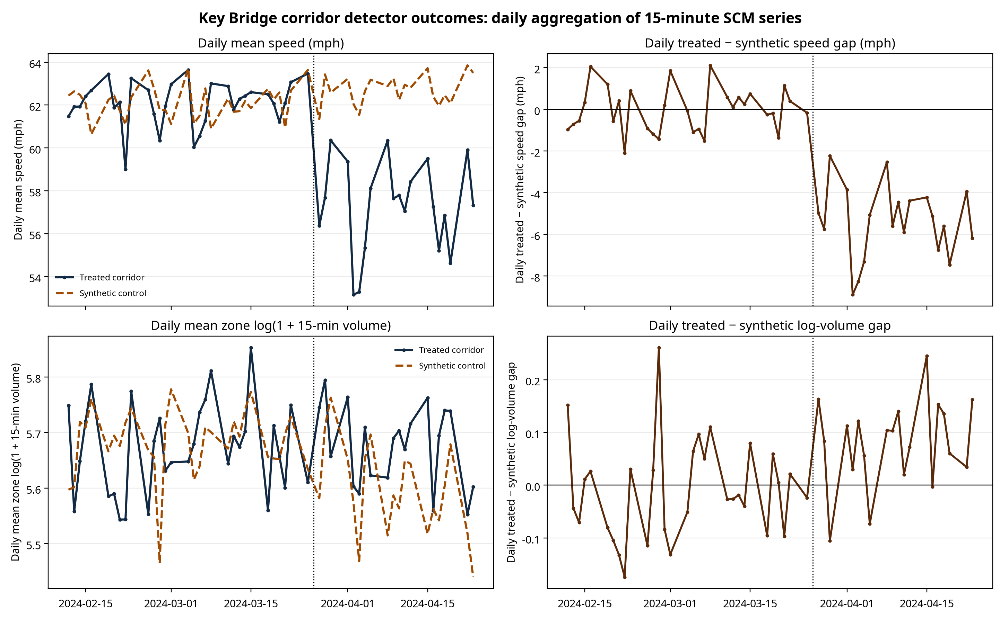
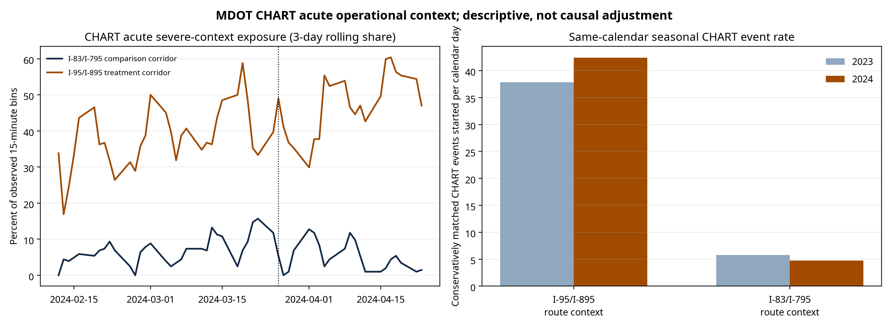

# Traffic Operations after a Bridge-Collapse Network Shock: Detector-Based Synthetic-Control Evidence from the Francis Scott Key Bridge Closure

**Daeyeol Chang**

*Author affiliation, postal address, ORCID, and corresponding-author email to be inserted before submission.*

**Target journal:** *Journal of Transportation Engineering, Part A: Systems*

> **Draft status.** This is a submission-oriented technical-paper draft. It reflects only the detector–MDOT CHART analyses that were actually executed. Bracketed editorial placeholders must be completed by the author. The final submitted file should be moved into ASCE’s current Word or Overleaf template, double-spaced in a single column, with continuous line numbering and separate figure files.

## Abstract

The collapse of the Francis Scott Key Bridge on Interstate 695 abruptly removed a major Baltimore harbor crossing and redirected traffic toward tunnel approaches. This study quantifies short-run operations on the officially advised I-95/I-895 diversion corridor using 15-min Maryland detector observations and MDOT Coordinated Highways Action Response Team (CHART) incident records. A conventional synthetic control was fitted only to 2024 pre-collapse detector outcomes. The treated outcome aggregates 36 pre-specified I-95/I-895 zones; the speed donor pool comprises seven balanced external Interstate zones, and the log-volume donor pool comprises 10 zones. Over the first 20 post-collapse weekdays, treated-corridor speed was 8.74 km/h (5.43 mph) below its synthetic counterfactual. The treated post/pre root-mean-square prediction error ratio exceeded the ratios for all seven speed donor placebos, although the finite-placebo randomization p-value was 0.125 and pre-event fit was imperfect (4.52 km/h [2.81 mph] RMSPE). The corresponding log-volume gap was +0.080, or approximately +8.34%, but was not unusual relative to donor placebos (p = 0.818). CHART records are used as route-segment operational context rather than automatic main-model controls because post-collapse incidents and lane closures may be mediators. Excluding bins with acute severe CHART context retained a negative speed gap of 7.37 km/h (4.58 mph). The results provide bounded evidence of substantial diversion-corridor speed deterioration and demonstrate a reproducible, incident-aware workflow for rapid operational assessment after network shocks.

**Keywords:** transportation resilience; traffic operations; bridge collapse; synthetic control; detector data; incident management; Francis Scott Key Bridge

## Practical Applications

Transportation agencies need credible operations evidence soon after a major link loss, but incident records and detector data play different roles. This study shows a practical workflow that first defines an affected corridor from an agency detour advisory, then estimates a pre-event-fitted synthetic counterfactual from detector data, and finally uses incident logs to characterize context and test sensitivity. For the Key Bridge disruption, the I-95/I-895 approaches operated approximately 8.74 km/h (5.43 mph) below the fitted counterfactual over the first 20 post-collapse weekdays. The result should support operational monitoring, traveler-information planning, detour management, and post-event after-action review; it should not be read as a networkwide welfare estimate or a safety effect.

The CHART audit also offers an implementation lesson. Some planned-roadway-closure records remain active for months. Treating every such record as an acute 15-min incident can make all corridor bins appear disrupted. The workflow therefore retains long-duration records in the inventory but defines an acute sensitivity indicator using valid events lasting 24 h or less. Agencies can apply this duration audit when combining incident-management logs with high-frequency performance data. The code, compact outputs, data contracts, and quality checks are publicly documented, while controlled detector inputs remain excluded from the repository.

## Introduction

At approximately 1:29 a.m. on March 26, 2024, the containership *Dali* struck a pier supporting the Francis Scott Key Bridge, causing a substantial portion of the Interstate 695 bridge to collapse (NTSB 2025). The shock immediately removed a critical harbor crossing from the Baltimore regional network. In its initial traffic advisory, the Maryland Department of Transportation State Highway Administration directed north–south traffic to the I-95 Fort McHenry Tunnel or I-895 Baltimore Harbor Tunnel; hazardous-materials movements prohibited in the tunnels were directed to the western section of I-695 (MDOT SHA 2024). The Maryland Transportation Authority similarly identified I-95 and I-895 as alternate harbor crossings (MDTA 2024).

Unplanned infrastructure failures create a difficult operational-evaluation problem. Agencies must distinguish an abnormal corridor performance change from recurring intraday patterns and broad regional conditions, while reporting results before detailed origin–destination, demand, or crash records are available. The Key Bridge event is particularly useful for this purpose because the affected I-95/I-895 approaches were identified in advance by the official advisory rather than selected from observed congestion after the event.

This study estimates the short-run detector-based operational response on that pre-specified diversion corridor. It makes three contributions. First, it applies a genuine conventional synthetic control, with nonnegative donor weights fitted only to pre-collapse 15-min outcomes, rather than describing a simple before–after or corridor-mean comparison. Second, it separates two complementary data roles: detector observations provide the primary speed and volume outcomes, while CHART provides route-segment operational context and explicitly secondary sensitivity tests. Third, it reports finite-donor randomization inference, an in-time placebo, and donor leave-one-out results, and it states the resulting identification limits directly.

## Literature Review

Transportation disruptions can reshape route, mode, and departure decisions as travelers learn about the altered network. In the I-35W Mississippi River bridge-collapse case, Zhu et al. (2010) combined loop-detector data, bus-ridership statistics, and traveler surveys and documented evolving traffic and behavioral responses during network re-equilibration. Chang and Nojima (2001) similarly showed why post-disaster transportation performance should be evaluated at the system level rather than inferred from damage to individual assets alone. These studies motivate high-frequency operating measures, but the growing availability of detector and incident logs permits more transparent counterfactual diagnostics after contemporary shocks.

Synthetic control is well suited to a setting with one exposed aggregate corridor and a finite set of plausible comparison units. The method creates a weighted combination of donor units that reproduces pre-intervention outcomes and attributes post-period divergence to the exposed unit conditional on counterfactual credibility (Abadie et al. 2010; Abadie et al. 2015; Abadie 2021). This framework does not eliminate the need to inspect pre-fit, donor composition, possible spillovers, and placebo distributions. These concerns are particularly important for a regional network shock, where treatment intensity may be heterogeneous and nearby routes can be affected indirectly.

The study also uses a same-weekday comparison-corridor model only as a complementary sensitivity exercise. Contemporary difference-in-differences research emphasizes that event-time coefficients require clear comparison assumptions and careful treatment of heterogeneity (Callaway and Sant’Anna 2021; Sun and Abraham 2021). This paper does not claim to implement a staggered-adoption estimator. Instead, it uses the comparison corridor to examine whether a negative treatment-minus-comparison speed differential remains when recurring weekday-by-time-of-day patterns and observed CHART context differences are considered. Because post-collapse incident records can lie on the causal pathway from the bridge closure to congestion, these models are interpreted as conditional associations rather than total causal effects.

## Data

### Detector Outcomes and Corridor Definitions

The primary data are Maryland INRIX/MDOT detector records, aggregated to 15-min zone-by-time observations. The 2024 study support spans February 12 through April 23 on weekdays from 5:00 a.m. to 9:45 p.m. The prepared panel contains 1,333,065 weekday zone-time rows across 433 zones. Twelve globally missing 15-min bins were preserved as data-quality findings and were not filled. No detector outcome was imputed.

The treatment corridor consists of 36 I-95/I-895 zones within the pre-specified Baltimore cross-harbor diversion approach. The comparison corridor consists of 21 I-83/I-795 zones in a spatially separated Baltimore-area box. The primary donor candidate pool contains 71 external Interstate zones located 30–100 km from Key Bridge after excluding I-95, I-895, I-695, and the I-83/I-795 comparison corridor. Candidate donors must satisfy pre-event coverage and volume screens. Requiring complete coverage over the common analytic time support leaves seven speed donors and 10 log-volume donors. Table 1 describes the data roles and Table 2 records the spatial design.

Speed is aggregated as the volume-weighted mean across the fixed 36-zone treatment corridor. Volume is represented by the mean zone-level \(\log(1+\text{15-min volume})\), which limits the influence of extreme counts while preserving zero-volume observations. The collapse date is omitted; the primary post-period begins March 27 and ends April 23. The speed analysis contains 2,099 pre-event and 1,355 post-event 15-min bins after excluding two bins lacking a valid treatment-corridor speed denominator.

### MDOT CHART Operational Context

MDOT CHART records include start and close times, standardized incident types, textual locations, and maximum lanes closed. The 2024 file contains 106,217 records. To avoid assigning text-only locations to individual detector zones, events are classified conservatively as route-segment context. I-895 and I-795 use primary-road matching; I-95 and I-83 additionally require a Baltimore study-segment exit, milepost, or landmark match. The resulting 12 February–23 April window contains 3,160 matched valid-duration events: 2,849 for the treatment route context and 311 for the comparison route context.

CHART is not used as a main-model confounder control. A collision, disabled vehicle, incident response, or lane closure after March 26 may be a consequence of altered traffic conditions and hence a mediator of the closure’s operational effect. It is instead used for descriptive context and prespecified sensitivity analysis. The input records include long planned-roadway-closure durations. Thus, acute severe context is defined as roadwork/construction/maintenance or a reported lane closure with valid duration no greater than 24 h; long-duration records remain in the event inventory but are not treated as acute 15-min exposure.

## Methodology

### Primary Synthetic-Control Estimator

Let \(Y_{Tt}\) denote the fixed-corridor treatment outcome at time \(t\), and let \(Y_{jt}\) denote the outcome for donor zone \(j\). We estimate nonnegative weights using only the pre-collapse period \(t\leq T_0\):

\[
\min_{w}\;\frac{1}{T_0}\sum_{t\leq T_0}\left(Y_{Tt}-\sum_{j=1}^{J} w_jY_{jt}\right)^2 + 10^{-6}\sum_{j=1}^{J} w_j^2,
\quad w_j\geq 0, \quad \sum_{j=1}^{J}w_j=1.
\tag{1}
\]

The small ridge term resolves arbitrary splitting among nearly collinear donors without changing the nonnegative, sum-to-one synthetic-control geometry. The post-event treated-minus-synthetic gap is \(\hat{\tau}_t=Y_{Tt}-\sum_jw_jY_{jt}\). We summarize mean gaps for the first 5, 10, and 20 post-event weekdays. The primary 20-weekday estimate is an operating-condition contrast, conditional on the donor-weighted counterfactual being credible absent the closure.

Inference uses in-space donor-zone randomization. Each balanced donor is assigned pseudo-treatment, its synthetic comparator is fitted from the remaining donors, and its post/pre RMSPE ratio is compared with the treated ratio. This produces a finite-placebo p-value rather than a repeated-sampling confidence interval. We also estimate a March 4 in-time pseudo-event and repeat the primary speed model after excluding each donor in turn.

### CHART-Informed Sensitivity Analyses

Two analyses probe, but do not identify away, contemporaneous incident context. First, the SCM is re-estimated after excluding treatment-route 15-min bins with an active acute severe CHART context. This changes the estimand because it conditions on a post-event variable. Second, a treatment-minus-comparison corridor gap is regressed on a post indicator, weekday-by-time-of-day fixed effects, and—in the conditioned specification—treatment-minus-comparison differences in acute severe context, collisions, disabled vehicles, and observed closed lanes. Percentile intervals use 250 stratified pre/post day-block resamples. These regressions are presented as descriptive conditional associations.

## Results and Discussion

### Primary Detector Evidence

The daily aggregation of the executed 15-min SCM series appears in Fig. 1. Pre-event speed differences fluctuate around zero, whereas treated-corridor speeds fall consistently below the synthetic series after the closure. Table 3 reports the numerical estimates. The first-5-weekday mean speed gap is −8.27 km/h (−5.14 mph), and the 20-weekday gap is −8.74 km/h (−5.43 mph). The speed pre-event RMSPE is 4.52 km/h (2.81 mph); the corresponding post/pre RMSPE ratio is 2.79. None of the seven balanced speed donor placebos has a ratio at least as large as the treated corridor, yielding a finite-placebo p-value of 0.125.

The result is operationally substantial but must be interpreted conservatively. The limited number of complete speed donors constrains randomization resolution, and pre-fit is not exact. The March 4 pseudo-event produces a +0.30 km/h (+0.19 mph) pseudo-post speed gap and RMSPE ratio of 1.07, much smaller than the actual-event values. Moreover, the full-post speed gap ranges from −8.99 to −8.43 km/h (−5.58 to −5.24 mph) across donor leave-one-out estimates. Together, these diagnostics support a persistent negative speed deviation that is temporally associated with the network shock; they do not establish an exact causal loss for every traveler or every segment.

The volume finding is less persuasive. The 20-weekday log-volume gap is +0.080, approximately +8.34%, but its RMSPE ratio is 1.09 and its finite-placebo p-value is 0.818. The March 4 pseudo-event has a similar ratio (1.09), and leave-one-out estimates range from −0.028 to +0.128 log points. Consequently, the available data do not support a robust claim of diversion-corridor volume growth, despite the positive point estimate.

### CHART Context and Conditioned Evidence

Figure 2 summarizes CHART acute severe context and a descriptive same-calendar comparison. From March 27 through April 23, conservatively matched treatment-route events began at 42.36 events/day in 2024 compared with 37.86 events/day in 2023; treatment-route collision starts were 7.75/day in 2024 compared with 5.39/day in 2023. The comparison-route event rate declined from 5.79 to 4.75 events/day. These figures describe incident-log context, not crash risk or a causal effect, because exposure, reporting, and response conditions can change.

After excluding treatment-route bins with acute severe context, the SCM speed gap remains −7.37 km/h (−4.58 mph); 1,285 pre-event and 721 post-event bins remain, with 634 post-event bins excluded. The unadjusted comparison-corridor gap model estimates a −7.77 km/h (−4.83 mph) post coefficient, with a 250-resample day-block interval of [−8.77, −6.83] km/h ([−5.45, −4.24] mph). Adding CHART context differences yields −7.52 km/h (−4.67 mph), with interval [−8.70, −6.36] km/h ([−5.41, −3.95] mph). The small 0.26-km/h (0.16-mph) shift is consistent with the conclusion that the speed pattern is not solely an artifact of the measured acute incident context. It is not evidence that a CHART-adjusted regression recovers the total effect of the closure.

### Implications and Limitations

For operations agencies, the main implication is methodological. A predeclared detour corridor, high-frequency detector outcomes, a transparently screened donor pool, and duration-audited incident records can produce an early, auditable evidence base for traffic-management decisions. The distinction between total-effect and conditioned analyses is crucial: controlling automatically for post-event incidents can suppress part of the disruption being evaluated.

The evidence is limited to observed weekday detector conditions on the designated approaches. The study does not observe individual rerouting, origin–destination changes, person travel, freight routing, travel-time reliability, weather, emergency restrictions, or safety outcomes. Potential donor spillovers and unobserved common shocks cannot be eliminated. The donor pool is small after complete-support requirements, and the speed counterfactual has nonzero pre-event RMSPE. CHART locations are route-text contexts rather than detector-zone exposure measurements. These constraints require the bounded interpretation used throughout the paper.

## Conclusion

This study evaluated short-run traffic operations after the Key Bridge collapse using a two-source detector–incident design. A conventional pre-event-fitted synthetic control estimates that the official I-95/I-895 diversion approaches operated 8.74 km/h (5.43 mph) below the synthetic speed counterfactual over the first 20 post-collapse weekdays. The treated speed RMSPE ratio exceeded each of seven donor-placebo ratios, but the finite-placebo p-value was 0.125 and pre-event fit was imperfect. The volume estimate was positive but not unusual relative to donor placebos.

The result survives an acute-CHART-context exclusion and remains similar in a CHART-conditioned comparison-corridor model. Those analyses are deliberately not elevated to incident-adjusted causal effects because incidents and lane closures after the collapse can be part of the causal pathway. The appropriate conclusion is therefore bounded evidence of a substantial diversion-corridor speed deterioration consistent with the bridge-collapse network shock.

For practice, the workflow offers a rapid assessment template: define corridors from official detour guidance, protect the pre-event outcome fit from post-event tuning, report finite-placebo diagnostics, audit long-duration incident records, and separate operating context from causal control variables. Future work should incorporate validated travel-time reliability, origin–destination or vehicle-class information, weather, and 2024 crash data when available, while preserving the same pre-specified and uncertainty-aware approach.

## Data Availability Statement

The executable code, configuration, compact estimates, figures, and quality audits supporting this study are available in the public repository: `https://github.com/dy-chang/urban-transport-intelligence/tree/main/network_shock_observatory`. The Maryland detector inputs are controlled/proprietary working copies and cannot be redistributed. MDOT CHART event information is publicly accessible through Maryland’s CHART system; derived route-context data are reproducible from the documented matching rules. A reproduction request requires authorized detector access and the annual CHART CSV extracts described in the repository data contract.

## Acknowledgments

[Insert funding statement, project support, data-use acknowledgments, and any agency review language.]

## Disclaimer

The findings and conclusions are those of the author(s) and do not necessarily represent the official views of any transportation agency, data provider, or funding organization.

## References

Abadie, A. 2021. “Using synthetic controls: Feasibility, data requirements, and methodological aspects.” *J. Econ. Lit.* 59 (2): 391–425. https://doi.org/10.1257/jel.20191450.

Abadie, A., A. Diamond, and J. Hainmueller. 2010. “Synthetic control methods for comparative case studies: Estimating the effect of California’s tobacco control program.” *J. Am. Stat. Assoc.* 105 (490): 493–505. https://doi.org/10.1198/jasa.2009.ap08746.

Abadie, A., A. Diamond, and J. Hainmueller. 2015. “Comparative politics and the synthetic control method.” *Am. J. Polit. Sci.* 59 (2): 495–510. https://doi.org/10.1111/ajps.12116.

Callaway, B., and P. H. C. Sant’Anna. 2021. “Difference-in-differences with multiple time periods.” *J. Econometrics* 225 (2): 200–230. https://doi.org/10.1016/j.jeconom.2020.12.001.

Chang, S. E., and N. Nojima. 2001. “Measuring post-disaster transportation system performance: The 1995 Kobe earthquake in comparative perspective.” *Transp. Res. Part A Policy Pract.* 35 (6): 475–494. https://doi.org/10.1016/S0965-8564(00)00003-3.

MDOT SHA (Maryland Department of Transportation State Highway Administration). 2024. “Updated traffic alert: Detours in place following collapse of Interstate 695 bridge over the Patapsco River (Francis Scott Key Bridge).” Accessed August 14, 2026. https://roads.maryland.gov/mdotsha/pages/pressreleasedetails.aspx?newsId=4983&PageId=818.

MDTA (Maryland Transportation Authority). 2024. “Key Bridge news.” Accessed August 14, 2026. https://mdta.maryland.gov/keybridgenews.

NTSB (National Transportation Safety Board). 2025. “Contact of containership *Dali* with Francis Scott Key Bridge and subsequent bridge collapse.” Investigation DCA24MM031. Accessed August 14, 2026. https://www.ntsb.gov/investigations/Pages/DCA24MM031.aspx.

Sun, L., and S. Abraham. 2021. “Estimating dynamic treatment effects in event studies with heterogeneous treatment effects.” *J. Econometrics* 225 (2): 175–199. https://doi.org/10.1016/j.jeconom.2020.09.006.

Zhu, S., D. Levinson, H. X. Liu, and K. Harder. 2010. “The traffic and behavioral effects of the I-35W Mississippi River bridge collapse.” *Transp. Res. Part A Policy Pract.* 44 (10): 771–784. https://doi.org/10.1016/j.tra.2010.07.001.

## Tables

**Table 1. Data sources, analytical roles, and availability boundary**

| Source | Observations used | Analytical role | Availability and boundary |
| --- | --- | --- | --- |
| Maryland INRIX/MDOT detector panel | 2024 weekday 15-min zone observations, 05:00–21:45; 433 zones in prepared panel | Primary speed and log-volume outcomes | Controlled/proprietary source; raw and derived zone-time panels are not redistributed. |
| MDOT CHART | Start/close time, standardized type, location text, and maximum lanes closed | Route-segment operational context; descriptive and conditioned sensitivity analyses | Public incident-management source; text match is not a detector-zone join. |
| MDOT/MDTA advisory | March 26 detour guidance | Treatment-corridor pre-specification | I-95/I-895 are official alternate harbor crossings. |

**Table 2. Corridor and donor-pool design**

| Analytical group | Definition | Zones/candidates | Role |
| --- | --- | ---: | --- |
| Treatment | I-95/I-895 Baltimore cross-harbor diversion approach | 36 zones | Fixed treatment outcome. |
| Comparison | I-83/I-795 Baltimore-area corridor | 21 zones | CHART-conditioned pair-gap sensitivity only. |
| External donor candidates | Interstate zones 30–100 km from Key Bridge, excluding I-95, I-895, I-695, and comparison corridor; screened on pre-period coverage and volume | 71 candidates | Potential SCM donors. |
| Balanced speed donor pool | Complete common support for speed | 7 zones | Primary speed SCM and randomization inference. |
| Balanced log-volume donor pool | Complete common support for log-volume outcome | 10 zones | Volume SCM and randomization inference. |

**Table 3. Primary conventional synthetic-control estimates**

| Outcome | Post window | Mean treated − synthetic gap | Pre RMSPE | Post/pre RMSPE ratio | Finite-placebo p-value |
| --- | ---: | ---: | ---: | ---: | ---: |
| Speed | 5 weekdays | −8.27 km/h (−5.14 mph) | 4.52 km/h (2.81 mph) | 2.61 | 0.125 |
| Speed | 10 weekdays | −8.77 km/h (−5.45 mph) | 4.52 km/h (2.81 mph) | 2.79 | 0.125 |
| Speed | 20 weekdays | **−8.74 km/h (−5.43 mph)** | **4.52 km/h (2.81 mph)** | **2.79** | **0.125** |
| Log-volume | 5 weekdays | +0.057 log points (+5.83%) | 0.226 | 0.93 | 0.818 |
| Log-volume | 10 weekdays | +0.059 log points (+6.13%) | 0.226 | 1.08 | 0.818 |
| Log-volume | 20 weekdays | **+0.080 log points (+8.34%)** | **0.226** | **1.09** | **0.818** |

*Note: The p-value is the share of in-space donor-zone placebo RMSPE ratios at least as large as the treated ratio. It is not a conventional sampling-based confidence interval.*

**Table 4. Diagnostic and CHART-informed sensitivity analyses**

| Analysis | Speed estimate | Volume estimate | Interpretation boundary |
| --- | ---: | ---: | --- |
| In-time placebo (March 4 pseudo-event) | +0.30 km/h (+0.19 mph); ratio 1.07 | +0.040 log points; ratio 1.09 | Checks whether a similarly placed pre-event break reproduces the actual pattern. |
| Speed donor leave-one-out | −8.99 to −8.43 km/h (−5.58 to −5.24 mph) | — | Speed finding is stable to removal of one balanced donor. |
| Acute-CHART-context restricted SCM | −7.37 km/h (−4.58 mph) | +0.102 log points (+10.72%) | Conditions on a post-event context variable; not the total effect. |
| Pair-gap, no CHART terms | −7.77 km/h (−4.83 mph), 250-resample interval [−8.77, −6.83] km/h | −0.056 log points, interval [−0.126, +0.030] | Treatment-minus-comparison association with weekday-by-time-of-day effects. |
| Pair-gap, CHART-conditioned | −7.52 km/h (−4.67 mph), interval [−8.70, −6.36] km/h | −0.071 log points, interval [−0.150, +0.028] | Conditional association; acute incident context may be a mediator. |

## Figure Captions

**Figure 1.** Daily aggregation of 15-min detector outcomes for the I-95/I-895 treatment corridor and its synthetic control. The vertical dashed line marks the March 26, 2024, collapse date, which is excluded from estimation. The top row shows daily mean speed and the treated-minus-synthetic speed gap; the bottom row shows the analogous log-volume series. Source: executed detector SCM analysis.

**Figure 2.** MDOT CHART acute operational context. Left: 3-day rolling share of observed 15-min bins containing an acute severe context event, defined from a valid CHART event duration of 24 h or less. Right: same-calendar event starts per day, March 27–April 23, in 2023 and 2024. The figure is descriptive and does not represent an incident-adjusted causal effect. Source: executed CHART route-context analysis.

