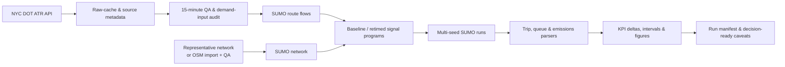
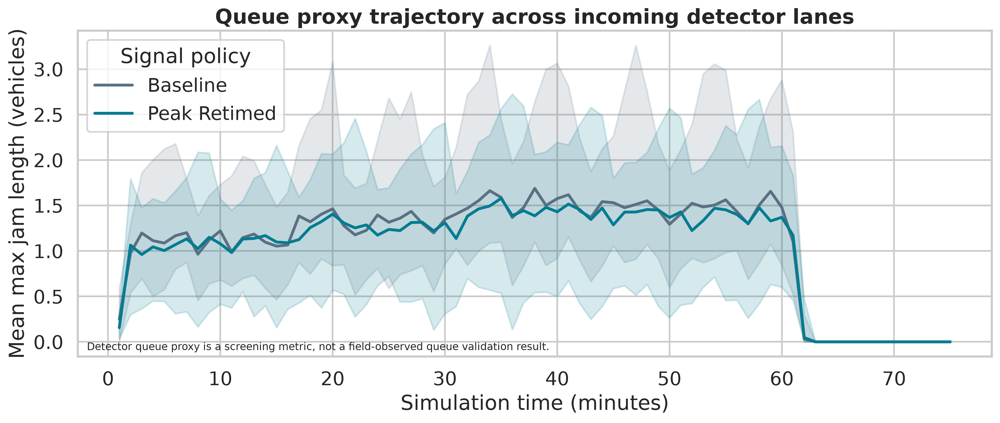

# Public-Data SUMO Operations Screening

> **Purpose.** This portfolio module demonstrates a reproducible, screening-level workflow that a public transportation agency can inspect from end to end: **public count acquisition → input QA and assumption ledger → SUMO network and demand assembly → policy scenario execution → uncertainty-aware operational and environmental reporting**.

The runnable reference scenario uses an official 15-minute NYC DOT automated traffic recorder (ATR) profile and Eclipse SUMO. The purpose is to demonstrate transparent model-building practice; it is **not** a calibrated design model, an ITS deployment, or a causal estimate of a retiming project’s effect. The difference is deliberate and made explicit in each output artifact.[1] [2]

## 1. Public-agency decision question

> For a peak-period intersection screening exercise, how do alternative green-time allocations change delay, queue proxies, completed trips, and modeled emissions **under the same documented demand and network assumptions**?

| Component | Reference implementation | Agency-facing use |
|---|---|---|
| Observed input | One four-quarter-hour directional volume profile from NYC DOT ATR data | Preserves official source, source query, collection window, street context, and raw-count cache metadata. |
| Network | Auditable two-lane, four-leg representative intersection built with `netconvert` | Runs consistently in CI or reviewer environments; an OSM-to-SUMO conversion command is provided for a real study network. |
| Demand | Count-constrained, straight-through SUMO flows | Identifies the one observed movement and labels every unobserved approach as a screening assumption. |
| Operations policy | Baseline signal split versus peak-direction retiming within a common 70-second cycle | Shows a familiar concept-of-operations alternative without claiming a field timing plan. |
| Evaluation | Five independent SUMO seeds, paired scenario deltas, empirical 2.5–97.5 percentile intervals | Avoids reporting a single stochastic run as a precise project result. |

## 2. Why this workflow is defensible

NYC DOT’s public ATR dataset provides 15-minute counts, date/time components, road segment IDs, geometry, street context, and direction; however, it is sampled rather than a full-year continuous feed. The pipeline therefore stores query provenance, validates basic count structure, and makes no unsupported imputation claim.[1] SUMO supports demand construction from count data, but its documentation emphasizes that a count-constrained route solution is generally non-unique. For that reason, the present benchmark uses explicitly declared straight-through flows and documents the route/turning-data path required for a study model.[2]



## 3. Repository structure

```text
sumo_public_ops/
├── public_counts.py      # Socrata acquisition, cache metadata, input QA, demand ledger
├── network.py            # netconvert network, route generation, signal programs, OSM command
├── run_sumo.py           # End-to-end execution with multi-seed scenario runs
├── metrics.py            # Tripinfo, queue detector, emissions, paired deltas and intervals
├── visualize.py          # 300-DPI input, KPI, and queue figures
├── data/
│   ├── raw/              # Runtime cache; excluded from Git
│   └── processed_demand.csv
├── network/              # Auditable representative nodes, edges, and SUMO net
├── scenarios/            # Generated flow inputs
└── outputs/              # Derived tables, figures, manifest, and run traces
```

## 4. Reproduce the complete workflow

The example was executed with **Eclipse SUMO 1.18.0**. SUMO can import OpenStreetMap data through `netconvert`; the provided `osm_to_sumo_command()` includes documented import heuristics, but every real-world geometry and signal controller must be reviewed before operational use.[3]

```bash
# Ubuntu example
sudo apt-get install -y sumo sumo-tools

# Python dependencies from the repository root
pip install -r requirements.txt

# Download the official public count, build SUMO inputs, run both policies × 5 seeds
PYTHONPATH=. python3 -m sumo_public_ops.run_sumo --replications 5 --refresh-counts

# Produce deterministic, report-ready graphics
PYTHONPATH=. python3 -m sumo_public_ops.visualize

# Validate the core transformations and KPI computations
PYTHONPATH=. pytest -q tests/test_sumo_public_ops.py
```

The run writes `outputs/run_manifest.json`, which is the primary hand-off artifact. It records the public-data query, timestamp, source URL, horizon, seeds, network status, demand assumptions, scenario timings, and resulting output files.

## 5. Scenario and input contract

| Item | Baseline | Peak retimed | Interpretation boundary |
|---|---:|---:|---|
| Cycle length | 70 s | 70 s | A common cycle isolates the green-allocation test. |
| North–south effective green | 32 s | 42 s | Mainline-oriented operational policy. |
| East–west effective green | 26 s | 16 s | Explicit trade-off; not a recommended field timing. |
| Clearances | 4 s yellow + 2 s all-red per phase | Same | Clearance assumptions are held constant. |
| Demand | Same source profile and seed-matched flows | Same | Demand is not re-optimized by scenario. |
| Network | Same representative two-lane geometry | Same | The benchmark is not a surveyed intersection. |

Only the `north_to_south` movement is directly anchored to the selected ATR observation. The opposing direction and cross-street movements are transparent scale factors, and no observed turning-movement count is claimed. Before an agency relies on the result, replace these values with appropriate field counts, turning movement counts, route candidates, vehicle classes, intersection geometry, and timing records.

## 6. Generated analysis and visual communication

The reference run completes the same number of trips under both policies. Across five paired seeds, the retimed policy shows **5.61% lower modeled mean time loss**, **4.72% lower stopped delay**, **4.98% lower detector queue proxy**, and **1.96% lower modeled CO₂** in this benchmark. These are **conditional simulation comparisons**, not estimates of real-world project benefits.


*Figure 1. The input audit deliberately separates an observed official ATR movement from scaled screening assumptions.*


*Figure 2. Points are seed means; bars are empirical 2.5–97.5 percentile intervals across five replications.*



*Figure 3. Queue estimates are lane-area detector proxies generated by SUMO, not field-measured queues.*

### Outputs for technical review

| File | Review purpose |
|---|---|
| `outputs/public_atr_profile.csv` | The retrieved official ATR rows used by the example. |
| `outputs/sumo_demand_input_audit.csv` | The observed-versus-assumed movement ledger. |
| `outputs/seed_level_kpis.csv` | One completed simulation result per seed and scenario. |
| `outputs/kpi_uncertainty_summary.csv` | Scenario means and empirical uncertainty intervals. |
| `outputs/scenario_deltas_vs_baseline.csv` | Paired difference versus baseline by KPI. |
| `outputs/queue_detector_results.csv` | 60-second lane-area detector queue proxy series. |
| `outputs/run_manifest.json` | Source, commands, assumptions, seeds, horizon, and limitations. |

SUMO tripinfo emissions are aggregated as mass: CO₂, NOx, and fuel fields are reported in mg in tripinfo output and are converted to g in the KPI table.[4]

## 7. Professional skill-set demonstrated

| Skill family | Evidence in this module |
|---|---|
| **Microsimulation and traffic operations** | SUMO `netconvert`, explicit signal programs, demand flows, lane-area detectors, tripinfo outputs, emissions device, seeded replications. |
| **Public-data engineering** | Official Socrata API query, stable cache naming, source metadata, schema coercion, count validation, runtime-data exclusion rules. |
| **Data preprocessing and input governance** | ATR profile construction, observed-versus-assumed movement ledger, input-audit visualization, manifest-based provenance. |
| **Planning and policy analysis** | Baseline-versus-alternative comparison, KPI scorecard, demand-control-network separation, explicit scope and decision limits. |
| **Statistical reasoning** | Multi-seed replications, paired scenario deltas, empirical percentile intervals, no false certainty from one simulation run. |
| **GIS and network readiness** | OSM-to-SUMO conversion path, QA warning for topology and traffic-light import, geography-preserving source metadata. |
| **Technical communication** | 300-DPI figures, data dictionary, reproducible commands, test suite, methodology and caveat documentation. |

## 8. Upgrade path for a real study

A decision-grade model should replace the representative geometry with a QA-reviewed OSM/survey network; use observed turning movements, vehicle classification, and multimodal inputs; calibrate against independent counts, travel times, and queues; test a broader range of demand and incident conditions; and have the timing and safety assumptions reviewed by the responsible agency. SUMO’s count-to-demand tools (`routeSampler`, `jtrrouter`, and related utilities) are designed for richer edge, turning, and OD observations when those data are available.[2]

## References

[1] [NYC Open Data, *Automated Traffic Volume Counts*](https://data.cityofnewyork.us/Transportation/Automated-Traffic-Volume-Counts/7ym2-wayt)

[2] [Eclipse SUMO, *Routes from Observation Points*](https://sumo.dlr.de/docs/Demand/Routes_from_Observation_Points.html)

[3] [Eclipse SUMO, *OpenStreetMap Import*](https://sumo.dlr.de/docs/Networks/Import/OpenStreetMap.html)

[4] [Eclipse SUMO, *TripInfo Output*](https://sumo.dlr.de/docs/Simulation/Output/TripInfo.html)
